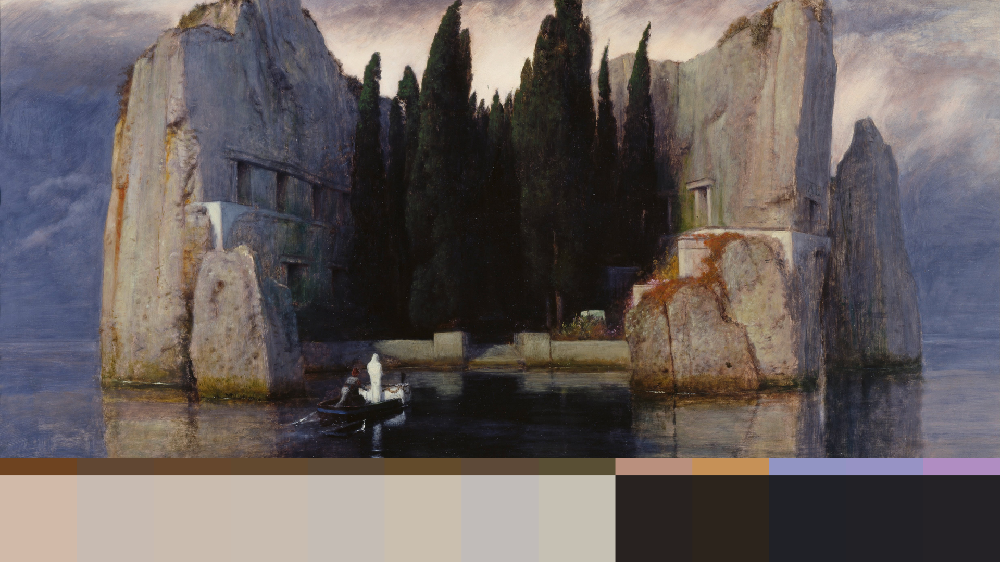
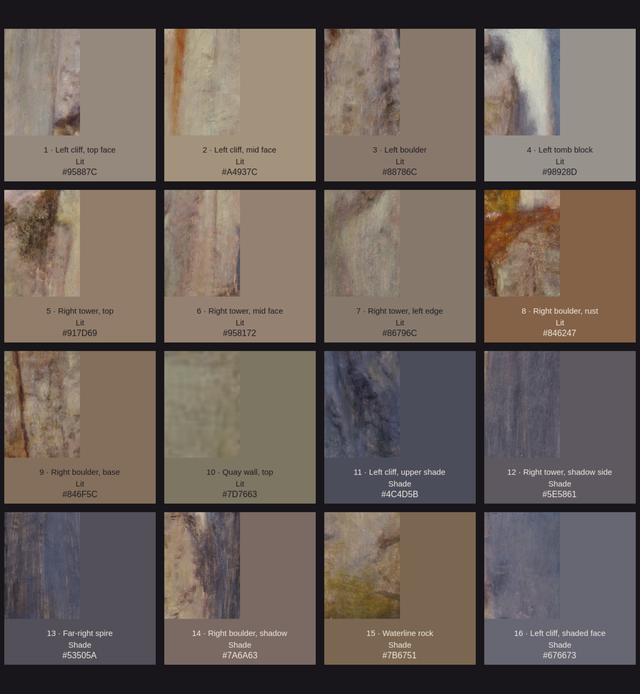
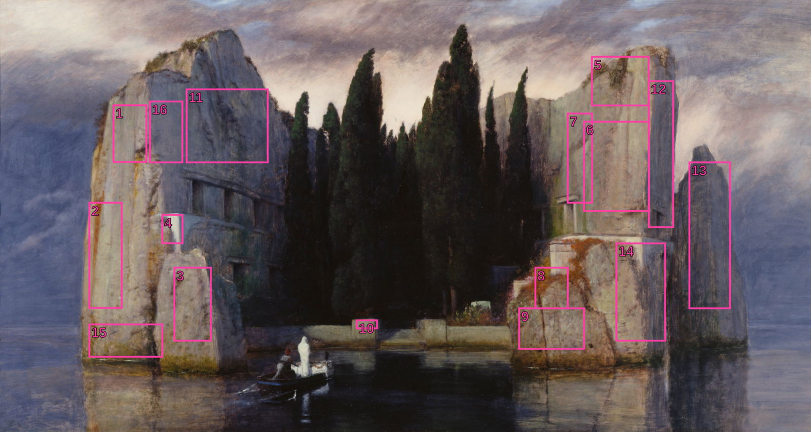

# Isle of the Dead Stones

Thirteen Omarchy themes, each built from one patch of stone in Arnold Böcklin's
*Isle of the Dead* (third version, 1883). Stones in light become light themes,
with the stone, lifted slightly, as the surface color; stones in shade become
dark themes. Text and terminal colors are weathered toward each stone and
checked for contrast. All thirteen share the painting as wallpaper, so every
preview carries a band with its stone, palette and type sample.

The main pair, [Isle of the Dead](https://github.com/benredrew/omarchy-isle-of-the-dead-theme)
and [Isle of the Dead Light](https://github.com/benredrew/omarchy-isle-of-the-dead-light-theme),
are packaged separately.



## Install

Omarchy installs one theme per repository, so copy these in by hand:

```bash
git clone https://github.com/benredrew/omarchy-isle-of-the-dead-stones.git
cp -r omarchy-isle-of-the-dead-stones/themes/* ~/.config/omarchy/themes/
```

Then choose one from Omarchy's theme picker, or run, for example:

```bash
omarchy theme set isle-lichen-rust
```

## Themes

Light themes run from pinkest to most olive, then dark themes by hue.

| Theme | Name | Mode | Stone | Background | Accent |
| --- | --- | --- | --- | --- | --- |
| **Lichen Rust** | `isle-lichen-rust` | light | 8 · right boulder, rust-colored lichen | `#D1BAA9` | `#6E4320` |
| **Tower Rose** | `isle-tower-rose` | light | 6 · right tower, middle face | `#C8BBB2` | `#614733` |
| **Boulder Base** | `isle-boulder-base` | light | 9 · right boulder, base | `#CABCAF` | `#66472D` |
| **Tower Crown** | `isle-tower-crown` | light | 5 · right tower, top | `#C9BDB1` | `#62492F` |
| **Tower Edge** | `isle-tower-edge` | light | 7 · right tower, left edge | `#C5BDB5` | `#5C4A37` |
| **Cliff Sand** | `isle-cliff-sand` | light | 2 · left cliff, middle face | `#CABFAF` | `#634B2B` |
| **Tomb Grey** | `isle-tomb-grey` | light | 4 · left tomb block | `#C1BCB9` | `#5D4938` |
| **Quay Olive** | `isle-quay-olive` | light | 10 · quay wall, top | `#C6C1B4` | `#594F34` |
| **Boulder Shadow** | `isle-boulder-shadow` | dark | 14 · right boulder, shadow | `#282220` | `#BA907E` |
| **Waterline** | `isle-waterline` | dark | 15 · rock at the waterline | `#2C241C` | `#C69157` |
| **Slate Shade** | `isle-slate-shade` | dark | 11 · left cliff, upper shade | `#202127` | `#9295C4` |
| **Violet Shade** | `isle-violet-shade` | dark | 16 · left cliff, shaded face | `#222126` | `#9793C5` |
| **Tower Shadow** | `isle-tower-shadow` | dark | 12 · right tower, shadow side | `#242226` | `#B08DC2` |

## Backgrounds

Every theme carries the same six `agent-theme-levels --method low-res-speckle
--levels 6` levels of the painting, shared with the
[Isle of the Dead](https://github.com/benredrew/omarchy-isle-of-the-dead-theme)
pair: **A Crisp**, **B Light 20**, **C Light 40**, **D Medium 60**, **E Medium
80**, and **F Strong**. Each averages the painting into hard-edged pixels that
keep its local color, reduces the colors with half-strength dithering and adds
light grain. D is the
intended look. Omarchy starts on A; switch with `omarchy theme bg next`.

## Previews

| Stone samples | Where they were taken |
| --- | --- |
|  |  |

Samples 1, 3 and 13 were left out of the collection.

## Photo

*Die Toteninsel* (*Isle of the Dead*), third version, 1883, by Arnold Böcklin;
oil on wood, [Alte Nationalgalerie, Staatliche Museen zu Berlin](https://www.smb.museum/en/museums-institutions/alte-nationalgalerie/home/).
The scan, from [Google Arts & Culture](https://artsandculture.google.com/asset/0wFgMTIQ3kZCpg)
via [Wikimedia Commons](https://commons.wikimedia.org/wiki/File:Arnold_B%C3%B6cklin_-_Die_Toteninsel_III_(Alte_Nationalgalerie,_Berlin).jpg),
is used uncropped at 4933×2628; each palette is averaged from one area of it.
The painting is in the public domain: Böcklin died in 1901, and a faithful
reproduction of a public-domain artwork carries no new copyright (§68 UrhG in
Germany; *Bridgeman v. Corel* in the US).

## License

[CC0 1.0 Universal](https://creativecommons.org/publicdomain/zero/1.0/): the
theme files, wallpapers and previews are dedicated to the public domain. Use
them for anything, no credit required.
